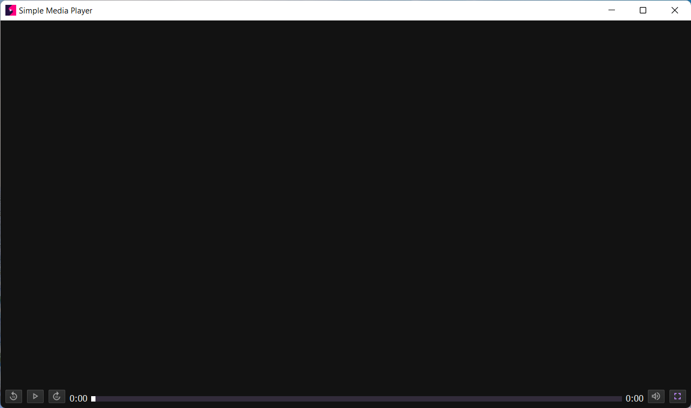
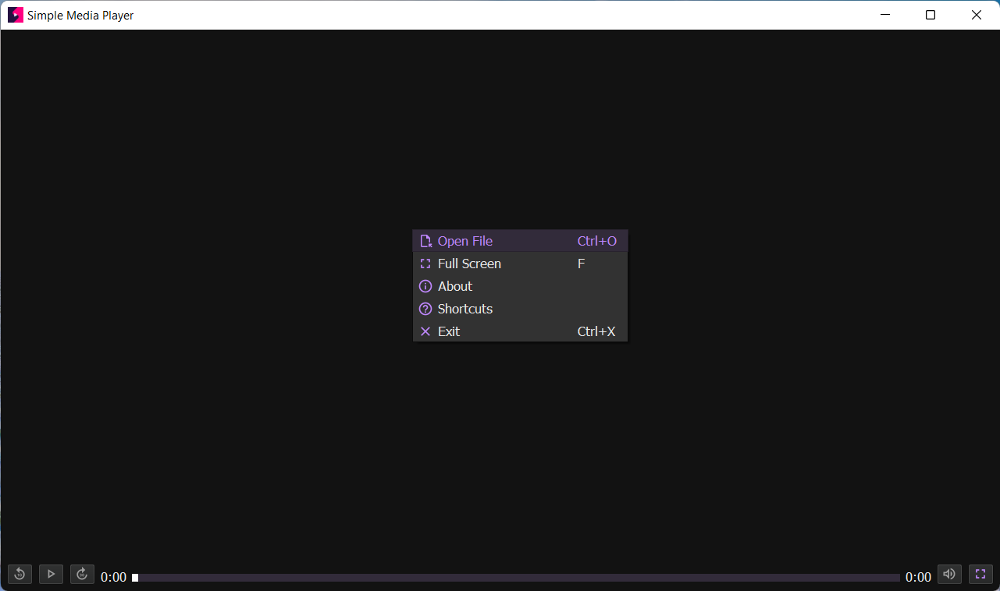
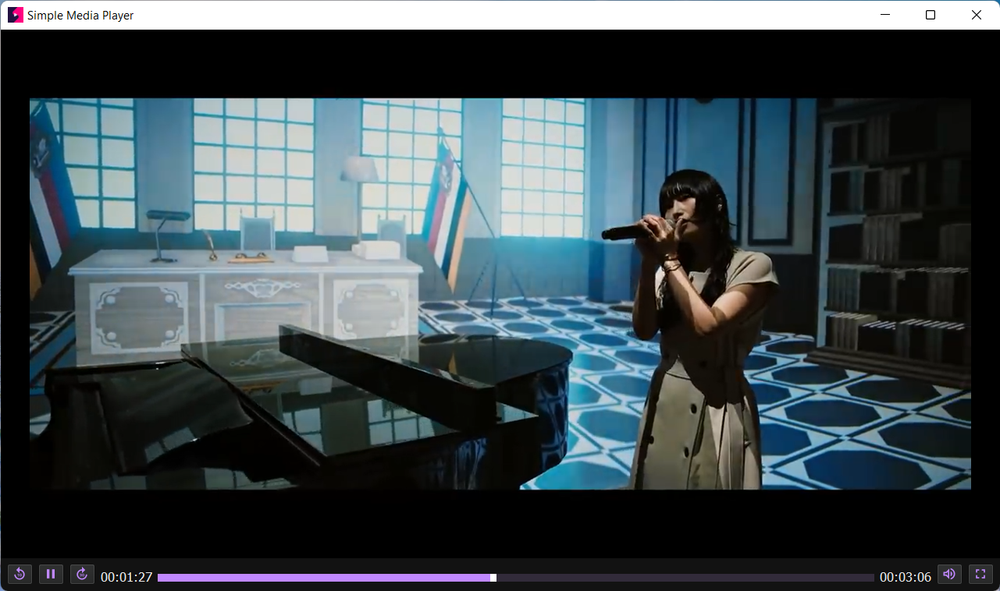

[](https://www.python.org/)
[](https://www.riverbankcomputing.com/software/pyqt/)

[](https://github.com/AMD825301/MediaPlayer/actions)
[](https://github.com/AMD825301/MediaPlayer/releases/latest/download/Simple.Media.Player.zip)

[](https://github.com/AMD825301)
[](https://github.com/thetrotfreak)
[](https://github.com/AMD825301/MediaPlayer/graphs/contributors)

# SIMPLE MEDIA PLAYER

> A *simple media player* built with **Python** & ❤️

## DOWNLOAD & INSTALLATION

### GETTING AN OPTIONAL PREREQUISITE

[K-Lite Codec Pack Basic](https://codecguide.com/download_k-lite_codec_pack_basic.htm)

### GETTING THE APP

[Simple Media Player](https://github.com/AMD825301/MediaPlayer/releases/latest/download/Simple.Media.Player.zip)

### RUNNING THE APP

- Extract the downloaded ```Simple.Media.Player.zip``` package
- Find the ```Simple Media Player.exe``` windows executable
- Start using it!

## IN-APP SHORTCUTS

|  **APP FUNCTION**  | **SHORTCUT** |
|:------------------:|:------------:|
|     Play Pause     |   ```K```    |
| Replay 10 seconds  |   ```J```    |
| Forward 30 seconds |   ```L```    |
|    Toggle Mute     |   ```M```    |
| Toggle Full Screen |   ```F```    |
|     Open File      | ```Ctrl+O``` |
|     Close App      | ```Ctrl+X``` |
|    Raise Volume    |      ⬆️      |
|    Lower Volume    |      ⬇️      |

## GALLERY





## LICENSE

MediaPlayer is licensed under the [MIT License](LICENSE)
